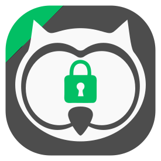
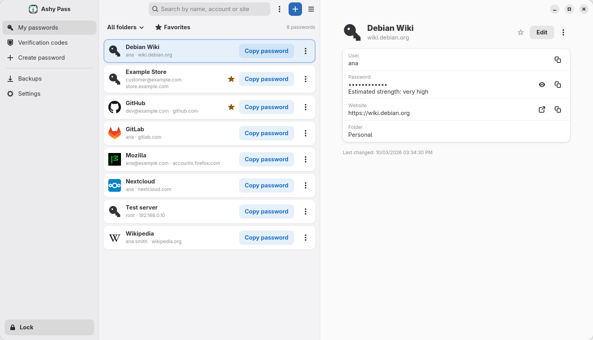
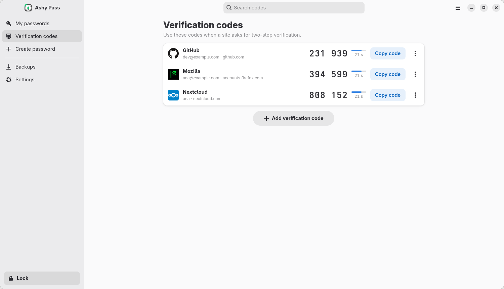
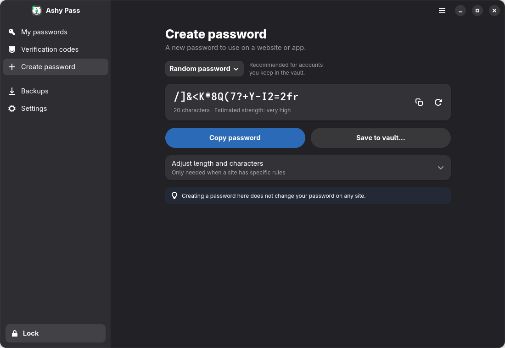

<p align="center">
  
</p>

<h1 align="center">Ashy Pass</h1>

<p align="center">
  A modern, private password manager for the Linux desktop.<br>
  Rust · GTK4 · libadwaita · Argon2id · AES-256-GCM
</p>

<p align="center">
  <a href="https://github.com/big-comm/ashypass/releases"></a>
  <a href="LICENSE"></a>
  <a href="https://www.rust-lang.org/"></a>
  <a href="https://www.gtk.org/"></a>
  <a href="https://bigcommunity.com"></a>
</p>

<p align="center">
  
</p>

## Overview

Ashy Pass keeps your passwords, verification codes and notes in an encrypted vault on your computer. The interface is organised around what you want to do: find an account and copy its password, read a two-step verification code, create a strong password, or keep a protected backup.

Nothing leaves your machine unless you turn on a sync or backup service. The vault is protected by a master password, derived with Argon2id and encrypted field by field with AES-256-GCM.

## Highlights

| | |
|---|---|
| **My passwords** | One list with folder and favourite filters, a visible *Copy password* button on every row and a details page for the rest. Wide windows show the list and the details side by side. |
| **Verification codes** | TOTP codes shown next to the service and account they belong to, with a countdown and one-click copy. Add a code by reading its QR code (image file, screen capture or clipboard) or by pasting the setup key. |
| **Create password** | A ready 20-character password with its real length and an estimated strength; random words or a numeric PIN when a site needs them. *Save to vault…* keeps the value even if the vault has to be unlocked first. |
| **Backups** | Protected `.ashy` copies with clear status: when the last copy was made, what it contains and which password restores it. Guided import from other apps with a preview before anything is written. |
| **Synchronization** | Two-way sync with Nextcloud Passwords, plus encrypted copies on WebDAV or Google Drive. Type just the server's domain — `https://` is added for you. |

<table>
  <tr>
    <td></td>
    <td></td>
  </tr>
  <tr>
    <td align="center"><sub>Verification codes</sub></td>
    <td align="center"><sub>Create password — follows the system dark style</sub></td>
  </tr>
</table>

## Features

### Security
- **Argon2id + AES-256-GCM.** The master password is never stored; per-field encryption with random nonces. Parameters can be auto-tuned for this computer. See [CRYPTO_SPEC.md](CRYPTO_SPEC.md).
- **Unlock off the main thread.** Key derivation runs in the background, so the window stays responsive. A key-check record detects a stale key instead of opening the vault with it.
- **PIN on this computer (optional).** The vault key is wrapped by a PIN (4 or more characters) and kept in the system keyring. After 5 wrong attempts the PIN is removed and the master password is required.
- **Forgot the master password?** If you unlock with the PIN, you can set a new master password by confirming the PIN; the vault is re-encrypted and the PIN keeps working. Without a PIN, Ashy Pass cannot recover the master password — it says so instead of promising otherwise.
- **Automatic lock** after a period of inactivity, when the screen locks and when the computer sleeps, with a warning banner and time to keep using it. An open form cannot hold the lock off indefinitely.
- **Clipboard hygiene.** Copied secrets are cleared after a configurable delay — only if the clipboard still holds what Ashy Pass copied — and marked with `x-kde-passwordManagerHint` so history managers that honour it skip them.
- **Password health check** for weak, reused and old passwords, accounts without a verification code and, optionally, known breaches through Have I Been Pwned (k-anonymity: only a 5-character hash prefix is sent).
- **Deleted items** are kept in a trash for a configurable number of days and can be restored.

### Your data stays safe
- **Restore never destroys.** A backup is fully validated before use; the vault it replaces is kept as `passwords.db.before-restore-<timestamp>`, and a wrong password changes nothing.
- **Imports are all or nothing.** Each import runs in one transaction. A preview lists recognised items, duplicates and anything that cannot be imported; the result separates a complete import from a partial one.
- **Upgrades keep everything.** Vaults, PIN records and settings written by 3.0.1 open unchanged and are upgraded in place, and 3.0.1 can still read a vault used by this version. A real 3.0.1 vault is part of the test suite (`crates/ashypass-core/tests/legacy_vault.rs`).
- **Sync safety.** Signing out of Nextcloud Passwords forgets its mappings, and a sync refuses to run when none of the linked entries exist on the server.
- **Unprotected exports are explicit.** A CSV export requires the master password, states what the file contains and is written with owner-only permissions.

### Import and export
- **Import from:** Bitwarden (JSON), 1Password (`.1pux`), KeePass / KeePassXC (`.kdbx`), browser exports from Chrome, Edge, Brave and Firefox (CSV), Aegis and andOTP (verification codes), and Ashy Pass backups. TOTP parameters, folders, tags, favourites, attachments and history are kept where the source provides them.
- **Export to:** protected `.ashy` backups (complete database snapshot), KeePass `.kdbx`, or plain CSV.

### Sync and cloud copies
- **Nextcloud Passwords** — two-way sync (REST API v1.0) with folders, tags and conflict handling; the losing password of a conflict is kept in the entry's history.
- **WebDAV / Nextcloud Files** — encrypted copies with generation-aware conflict detection.
- **Google Drive** — encrypted copies over REST with OAuth 2.0 PKCE; tokens are stored in the system keyring.

### More
- **External drives** (*Tools → External drives*): list removable drives and encrypt them with LUKS2 through a polkit-protected helper, with the device identity checked before any destructive step.
- **Command line:** `ashypass-cli` shares the vault and keyring with the desktop app.
- **Adaptive layout** from narrow to wide windows, keyboard shortcuts, and accessible names on icon buttons.
- **29 languages:** bg, cs, da, de, el, en, es, et, fi, fr, he, hr, hu, is, it, ja, ko, nl, no, pl, pt, pt_BR, ro, ru, sk, sv, tr, uk, zh.

## Not available yet

- **Browser extension.** The native-messaging host is in place, but there is no published extension yet, so the option is hidden in Settings.
- **Security keys (FIDO2) for the vault.** Kept out of the interface until registration and verification are fully implemented. External drives can already use FIDO2 keyslots.

## Requirements

| | |
|---|---|
| Operating system | Linux with GTK 4.12+ and libadwaita 1.5+ |
| Build tools | Rust 1.85+, `pkg-config`, GTK4 and libadwaita development headers |
| Runtime | `gtk4`, `libadwaita`, `gettext`, `sqlite`, `openssl`; optional Secret Service (GNOME Keyring or KWallet) for the PIN and automatic login |
| External drives (optional) | `cryptsetup`, `polkit`; `systemd-cryptenroll` for FIDO2 keyslots |

## Installation

### Arch Linux, Manjaro and BigLinux

```bash
cd pkgbuild
makepkg -si
```

The package installs the application, translations, icon, desktop file, browser host and the drive helper.

### From source

```bash
git clone https://github.com/big-comm/ashypass.git
cd ashypass
cargo build --release --workspace
./target/release/ashypass
```

Google Drive needs OAuth credentials at build time; without them the Google Drive section shows a "not configured" notice:

```bash
ASHYPASS_GOOGLE_CLIENT_ID=xxx.apps.googleusercontent.com \
ASHYPASS_GOOGLE_CLIENT_SECRET=xxx \
  cargo build --release -p ashypass-app
```

## Getting started

1. **Create your vault.** Choose a master password and write it down somewhere safe — it cannot be recovered.
2. **Bring your passwords.** *Backups → Import passwords* and pick the app you are coming from.
3. **Optional:** set a PIN in *Settings → Protection* for quicker unlocking on this computer.
4. **Make a backup.** *Backups → Create backup* writes a protected `.ashy` file; keep a copy off this computer.

### Keyboard shortcuts

| Shortcut | Action |
|---|---|
| <kbd>Ctrl</kbd>+<kbd>1</kbd> … <kbd>Ctrl</kbd>+<kbd>4</kbd> | My passwords, Verification codes, Create password, Backups |
| <kbd>Ctrl</kbd>+<kbd>F</kbd> | Search the current page |
| <kbd>Ctrl</kbd>+<kbd>N</kbd> | Add a password (or a code on the codes page) |
| <kbd>Ctrl</kbd>+<kbd>L</kbd> | Lock |
| <kbd>Ctrl</kbd>+<kbd>,</kbd> | Settings |
| <kbd>F1</kbd> | All shortcuts |

### Command line

```bash
ashypass-cli list                     # entries, without secrets
ashypass-cli list --search github     # filter by title, user or URL
ashypass-cli show <id-or-title>       # one decrypted entry
ashypass-cli totp <id-or-title>       # current verification code
ashypass-cli gen --length 24          # generate a password
ashypass-cli add                      # add an entry interactively
ashypass-cli drives list              # removable drives
```

## Files

| Path | Contents |
|---|---|
| `~/.local/share/ashypass/passwords.db` | Encrypted vault (SQLite) |
| `~/.config/ashypass/settings.json` | Preferences: lock and clipboard delays, appearance, trash retention |
| `~/.config/ashypass/backup-status.json` | When and where the last backup was made |
| `~/.local/share/ashypass/favicons/` | Cached site icons |
| System keyring | PIN record, optional master password, service credentials and tokens |

## Architecture

```
crates/
├── ashypass-core           Library without GTK: crypto, vault, importers, sync, backup
├── ashypass-app            GTK4 / libadwaita desktop application
├── ashypass-cli            Terminal companion
├── ashypass-native-host    Native-messaging host for a future browser extension
├── ashypass-drives         LUKS2 detection and encryption pipeline
└── ashypass-drives-helper  Privileged helper started through polkit
locale/                     Translations (.po) and template
pkgbuild/                   Arch Linux package
```

## Development

```bash
cargo fmt --all
cargo clippy --workspace --all-targets -- -D warnings
cargo test --workspace
./scripts/update-translations.sh      # refresh the template, merge and compile catalogues
```

UI strings use the `tr!` and `trn!` macros (gettext). Write source strings in English; translations live in `locale/*.po`.

## Contributing

Issues and pull requests are welcome. Please branch from `main`, keep `fmt`, `clippy` and the test suite green, add tests next to the code you change, and write commit messages in English.

## License

[MIT](LICENSE)

## Acknowledgments

GNOME (GTK4 and libadwaita) · RustCrypto (`argon2`, `aes-gcm`, `sha2`) · rusqlite · `rqrr` (QR decoding) · Have I Been Pwned · Nextcloud · BIP39 word list

---

<p align="center">
  <a href="https://github.com/big-comm/ashypass/issues">Report a bug</a> ·
  <a href="https://github.com/big-comm/ashypass/issues">Request a feature</a> ·
  <a href="https://github.com/big-comm/ashypass/discussions">Discussions</a>
</p>
